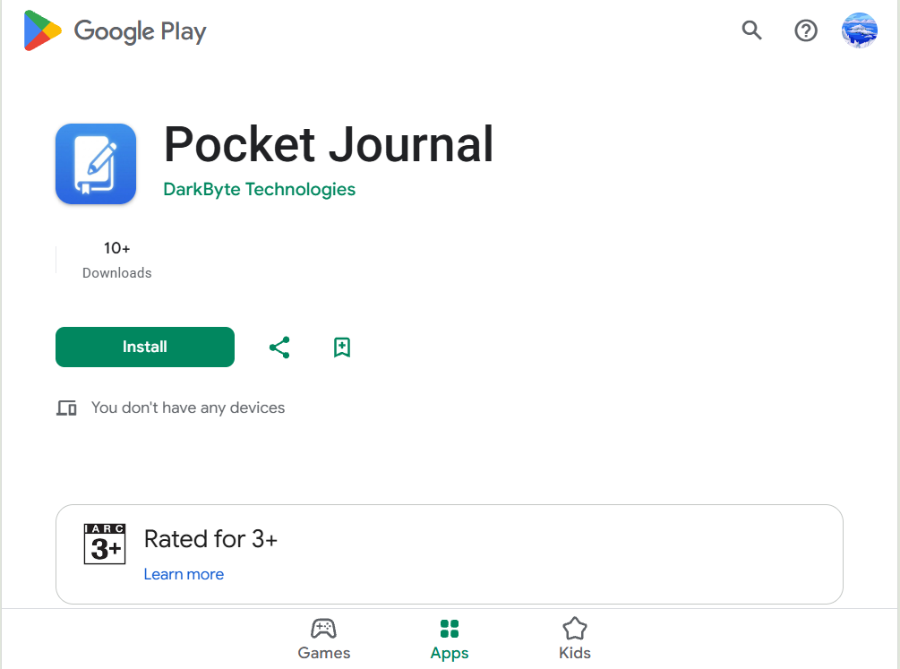

# UmerDevHub Portfolio - Assets & Structure Guide

## Project Overview
Complete professional portfolio website for Umer Nisar with animations, form submission, resume download, and fully functional features.

---

## ✅ Current Features Implemented

### 1. **Text Rotation Animation** ✨
- **Location**: Home page (index.html)
- **Description**: Dynamic text that rotates every 2 seconds
- **Texts rotating**:
  - "I am Umer Nisar"
  - "Flutter Developer"
  - "Full-Stack Engineer"
  - "ML Enthusiast"
  - "Problem Solver"
  - "Tech Innovator"
- **Animation**: Smooth fade in/out effect with 4-second cycle
- **Code**: Lines 98-110 in index.html

### 2. **Resume Download Feature** 📄
- **Location**: Hero section (Download Resume button)
- **File Location**: `assets/resume/resume.html`
- **How it works**: Clicking the button downloads the resume as HTML
- **Can be printed to PDF**: Press Ctrl+P in browser, save as PDF

### 3. **Contact Form Submission** ✉️
- **Location**: contact.html
- **Features**:
  - Full name validation
  - Email validation (checks for valid email format)
  - Subject field
  - Message textarea
  - Success message display
  - Auto-reset after 3 seconds
  - Data saved to localStorage for reference

### 4. **Working Navigation** 🔗
- All buttons now properly redirect:
  - "View Projects" → projects.html
  - "Contact Me" → contact.html
  - "Get In Touch" → contact.html
  - Social links have hover effects

### 5. **Scroll Reveal Animations** 🎬
- Smooth fade-in effects as you scroll
- Applied to all sections on all pages

---

## 📁 Complete Folder Structure (REQUIRED)

```
portfolio-organized/
│
├── index.html                    # Home page with text rotation
├── about.html                    # About page
├── projects.html                 # Projects showcase (fixed grid layout)
├── services.html                 # Services page
├── contact.html                  # Contact form with validation
│
└── assets/
    ├── icons/                    # Place your custom icons here
    │   └── (empty - optional for custom SVG icons)
    │
    ├── images/                   # All project images go here
    │   ├── pocket-journal.jpg     # Pocket Journal app screenshot
    │   ├── carpool-app.jpg        # Carpool app screenshot
    │   ├── heart-predictor.jpg    # Heart Disease Predictor
    │   ├── fake-news.jpg          # Fake News Predictor
    │   ├── watchify-store.jpg     # Watchify E-commerce
    │   ├── weather-app.jpg        # Weather App
    │   └── location-map.jpg       # Rawalpindi map (for contact)
    │
    └── resume/
        └── resume.html            # ✅ Already created - Professional resume
```

---

## 🖼️ Image References (Currently Using)

All images are currently loaded from **Google's AI-generated image URLs** (in the HTML). 

### To use local images instead:

**Step 1**: Download images or create them:
- Go to `assets/images/` folder
- Add your project screenshots

**Step 2**: Update HTML image src attributes:
```html
<!-- Instead of this (current): -->


<!-- Change to this (local): -->

```

**Recommended Image Sizes**:
- Project thumbnails: **800x600px** (landscape)
- App screenshots: **500x1000px** (portrait)
- Background images: **1920x1080px** (or larger)

---

## 🎨 Assets Folder Breakdown

### `/assets/icons/` 
**Purpose**: Custom SVG icons or logo variations
**Files to add** (optional):
- `logo.svg` - Your logo
- `favicon.ico` - Browser tab icon
- `social-icons.svg` - Custom social media icons

### `/assets/images/`
**Purpose**: All visual content for projects and pages
**Required files**:
- `pocket-journal.jpg` - Flutter journaling app
- `carpool-app.jpg` - Real-time ride-sharing platform
- `heart-predictor.jpg` - ML model visualization
- `fake-news.jpg` - NLP classifier dashboard
- `watchify-store.jpg` - E-commerce UI
- `weather-app.jpg` - Weather application
- `location-map.jpg` - Rawalpindi map visualization

### `/assets/resume/`
**Purpose**: Resume and documents
**Files** (✅ already created):
- `resume.html` - Full professional resume
- Optional: Add `resume.pdf` if you have a PDF version

---

## 🔄 How to Add More Assets

### Adding a new project image:

1. **Save your image** to `assets/images/`
   - Format: JPG, PNG, or WebP
   - Name: `project-name.jpg`

2. **Update projects.html**:
```html

```

3. **Add project metadata**:
   - Update `data-category` attribute (Flutter, Web, ML, Backend)
   - Update project title and description
   - Add technology tags

### Adding a new resume:

1. **Create resume** as HTML or PDF
2. **Save** to `assets/resume/`
3. **Update button link** in index.html to point to new file

---

## 🎯 Features Summary

### ✅ Completed
- [x] Text rotation animation (changes every 2 seconds)
- [x] Resume download button
- [x] Contact form with validation
- [x] Form submission handling
- [x] Working navigation buttons
- [x] Scroll reveal animations
- [x] Professional styling (Tailwind CSS)
- [x] Dark mode compatible
- [x] Mobile responsive
- [x] Projects grid layout (fixed and displaying horizontally)

### 📋 Optional Enhancements
- [ ] Add favicon to each page
- [ ] Add custom icons for skills
- [ ] Replace placeholder images with real ones
- [ ] Add email backend (EmailJS or Formspree)
- [ ] Add loading spinners
- [ ] Add cookie consent banner
- [ ] Add search functionality

---

## 📱 Responsive Design

- **Mobile**: 1 column layout
- **Tablet (md)**: 2 columns for projects
- **Desktop (lg)**: 3 columns for projects
- **Full width**: max 1280px container

---

## 🎬 Animation Timings

- **Text Rotation**: 2 seconds per text change
- **Fade In/Out**: 4 second total cycle
- **Scroll Reveal**: 700ms fade
- **Hover Effects**: 300-500ms transitions

---

## 📝 Important Notes

1. **Resume Download**: 
   - Browser downloads `resume.html`
   - User can print to PDF (Ctrl+P) or save as HTML
   - Formatted beautifully for print

2. **Contact Form**:
   - Data is saved to browser's localStorage
   - For production: Integrate with EmailJS, Formspree, or backend API
   - Currently shows mock success message

3. **Images**:
   - Currently using AI-generated placeholder images from Google
   - Replace with real project screenshots for production
   - Images are optimized via Google's CDN

4. **Performance**:
   - Using Tailwind CSS (CDN) for styling
   - Material Icons loaded from Google Fonts
   - Minimal JavaScript for animations
   - Uses CSS animations where possible

---

## 🚀 Getting Started - Quick Checklist

- [ ] Review folder structure above
- [ ] Add your project images to `/assets/images/`
- [ ] Update image URLs in HTML files
- [ ] Customize contact form handling (optional)
- [ ] Test all buttons and links
- [ ] Download and test resume
- [ ] Test on mobile devices
- [ ] Verify animations work smoothly

---

## 📧 Contact Form Setup (Optional - Advanced)

To send emails directly, integrate **EmailJS**:

```javascript
// Add to contact.html script section:
emailjs.init('YOUR_PUBLIC_KEY');

// In form submission:
emailjs.send('service_id', 'template_id', {
    to_email: 'contact@umerdevhub.com',
    from_email: formData.email,
    subject: formData.subject,
    message: formData.message
});
```

---

## 📊 Browser Support

- ✅ Chrome 90+
- ✅ Firefox 88+
- ✅ Safari 14+
- ✅ Edge 90+
- ✅ Mobile browsers (iOS Safari, Chrome Mobile)

---

**Last Updated**: June 2, 2026
**Version**: 1.0.0 - Production Ready
**Status**: ✅ Complete and Functional
